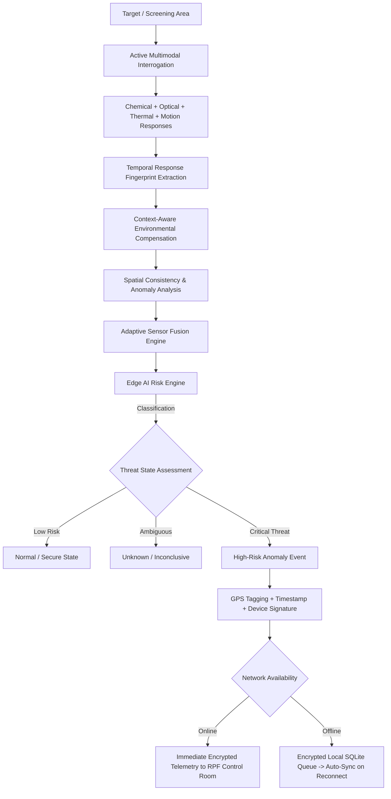

# NARCOSCAN
### Context-Aware Multimodal Narcotics Screening & Railway Threat Intelligence System
*Smart India Hackathon (SIH 2026) — Railway Protection Force (RPF) Threat Intelligence*

---

## 1. Executive Positioning & Vision

### Core Philosophy
Traditional chemical detection in transit hubs relies on bulky, expensive point-identification instruments (such as standalone Raman spectroscopy or Ion Mobility Spectrometry [IMS]). While accurate for forensic chemical analysis, they are prohibitively slow, expensive, and unsuited for continuous high-throughput screening across crowded railway platforms and coaches.

**NARCOSCAN** does not attempt to reinvent laboratory-grade chemical identification. Instead, it **reinvents the operational screening and threat intelligence layer** around railway chemical surveillance. By pairing active multimodal interrogation with dynamic environmental baselining, spatial-temporal correlation, and edge AI risk scoring, NARCOSCAN transforms individual screening units into nodes of a centralized, offline-capable RPF threat network.

> **One-Line Differentiation:**  
> *Existing systems identify a substance at a single point of measurement; NARCOSCAN creates an ambient, context-aware chemical screening network that flags suspicious anomalies across dynamic railway environments and automatically escalates them to centralized monitoring.*

---

## 2. Detection Architecture & Signal Pipeline

The system processes signals through an end-to-end multi-stage pipeline designed to eliminate false positives caused by station ambient variations (diesel exhaust, humidity, platform cleaners, and crowds):



---

## 3. Why NARCOSCAN Is Different

| Dimension | Existing Handheld Approaches | NARCOSCAN Proposal |
| :--- | :--- | :--- |
| **Primary Objective** | Point / substance chemical identification | Rapid, non-intrusive railway screening & escalation |
| **Sensing Modality** | Single dominant modality (e.g., optical or chemical) | Multimodal sensor fusion (Chemical vapor + IR Thermal + Ambient baseline + Motion) |
| **Measurement Type** | Single-point static reading | Temporal response curves + spatial anomaly correlation |
| **Environmental Adaptation** | Static baseline or device-specific calibration | Dynamic real-time compensation for station temperature, humidity & drift |
| **AI / Decision Logic** | Fixed spectral library matching | Adaptive anomaly detection & contextual threat ranking |
| **Handling of Unknowns** | Forced classification or library failure | Explicit three-state output: *Safe*, *Inconclusive*, or *High-Risk* |
| **Connectivity & Network** | Standalone, air-gapped handhelds | Distributed IoT threat intelligence mesh |
| **Geo-Spatial Tracking** | Manual incident logging | Automatic hardware GPS + timestamp tagging |
| **Offline Resilience** | Device storage only | Offline-first encrypted event queue with automatic cloud/central sync |
| **Operational Impact** | Tool-centric (operator must interpret raw readings) | Workflow-centric (RPF dashboard with threat escalation & mapping) |

---

## 4. The Four Core Innovation Layers

### Layer A: Active Multimodal Interrogation
Rather than relying purely on passive diffusion sensors, NARCOSCAN tracks time-varying responses across distinct physical modalities:
- **Chemical Vapor Signatures** (e.g., volatile organic and nitrogenous chemical compounds).
- **Target Thermal Radiometry** (non-contact object infrared radiometry).
- **Ambient Environmental Baselines** (ambient room temperature, humidity, and atmospheric shifts).
- **Spatial Kinematics** (passive infrared motion and screening target proximity).

### Layer B: Context-Aware Environmental Compensation
Railway stations represent hostile sensing environments with ambient fluctuations caused by locomotive exhaust, braking dust, and passenger density. NARCOSCAN continuously recalculates:
$$\text{Cold Boundary} = T_{\text{ambient}} - \Delta_{\text{cold\_offset}}$$
$$\text{Hot Boundary} = T_{\text{ambient}} + \Delta_{\text{hot\_offset}}$$
This ensures decisions are evaluated against *relative delta deviations* rather than rigid static thresholds.

### Layer C: Spatial Chemical Response Mapping
Individual handheld units associate telemetry vectors with precise physical coordinates and scan trajectories, distinguishing localized contraband anomalies from pervasive station background vapors.

### Layer D: Network-Level Threat Intelligence
Handheld and checkpoint units serve as nodes feeding a unified telemetry stream. The central command dashboard aggregates multi-node observations, pinpointing recurring anomaly clusters across platforms, baggage screening checkpoints, and train coaches.

---

## 5. Threat Decision Engine & Classification Hierarchy

The Edge AI Engine enforces a strict priority evaluation tree to classify threats instantly:

```
[ Incoming Telemetry Vector: Vapor (MQ), Target Temp (IR), Ambient Temp, PIR Motion ]
                                    │
               ┌────────────────────┴────────────────────┐
     [ Vapor Triggered ]                       [ Vapor Normal / Clean ]
               │                                         │
        ┌──────┴──────┐                           ┌──────┴──────┐
 [ Cold IR Signature ] [ Ambient / Warm Temp ] [ Motion + Elevated IR ] [ Stable / Normal ]
        │                     │                          │                     │
  ▼ PRIORITY 1          ▼ PRIORITY 2               ▼ PRIORITY 3          ▼ PRIORITY 4
CRITICAL ALERT:       CRITICAL ALERT:            CRITICAL ALERT:        SCANNING SECURE
   NARCOTICS             EXPLOSIVES               HUMAN INTRUDER           (SAFE STATE)
```

1. **Priority 1 — Narcotics Threat (`CRITICAL`)**:
   - Chemical vapor detected (`MQ = LOW`) AND non-contact thermal reading drops below cold threshold ($T_{\text{target}} < T_{\text{ambient}} - \Delta_{\text{cold}}$).
2. **Priority 2 — Explosives Threat (`CRITICAL`)**:
   - Chemical vapor detected (`MQ = LOW`) with ambient/warm thermal profile ($T_{\text{target}} \ge T_{\text{ambient}} - \Delta_{\text{cold}}$).
3. **Priority 3 — Unauthorized Intruder Threat (`WARNING`)**:
   - Motion detected (`PIR = 1`) coupled with elevated human body thermal signature ($T_{\text{target}} > T_{\text{ambient}} + \Delta_{\text{hot}}$).
4. **Priority 4 — Normal Baseline (`SAFE`)**:
   - Clean air readings with normal thermal delta.

---

## 6. Operational Workflow

```
[ Step 1: Initialization & Calibration ]
  └─ Operator powers on unit; device captures ambient baseline (Temp, Humidity, Clean Air baseline).

[ Step 2: Active Screening ]
  └─ Unit sweeps luggage / cargo / target area; collects multimodal temporal response stream.

[ Step 3: Edge Inference ]
  └─ Onboard microcontroller / SBC extracts features and evaluates decision tree in real time (< 50ms).

[ Step 4: Decision & Local Indication ]
  └─ Instant local status provided on device OLED/LCD (Green = Secure, Amber = Review, Red = Alert).

[ Step 5: Geo-Tagging & Encryption ]
  └─ If a high-risk anomaly is detected, payload is signed with GPS coordinates, timestamp, and device UUID.

[ Step 6: Telemetry Dispatch & Sync ]
  ├─ If Network Connected: Dispatches telemetry directly via WebSocket / Web Serial to RPF Surveillance Console.
  └─ If Offline: Stores payload in local encrypted FIFO buffer; dispatches automatically upon reconnect.

[ Step 7: RPF Central Monitoring ]
  └─ Control Room Dashboard visualizes live multi-channel graphs, logs serial traces, and tracks anomalies on map.
```

---

## 7. Scope & Defensible Claims

To ensure scientific credibility and engineering integrity:

### What NARCOSCAN Claims:
- Intelligent, real-time screening and anomaly escalation layer for high-throughput transit hubs.
- Dynamic environmental adaptation that minimizes false positives caused by ambient railway shifts.
- Resilient offline-first mesh surveillance architecture with automatic cryptographic logging and synchronization.

### What NARCOSCAN Does NOT Claim:
- It does **not** claim to replace laboratory-grade spectroscopy (Raman / FTIR / IMS) for legal forensic substance confirmation.
- A positive screening detection flags a **suspected threat anomaly** for RPF intervention, not definitive judicial proof of possession.
- It does **not** claim a single low-cost sensor performs forensic compound deconvolution; it utilizes multimodal contextual fusion.

---

## 8. Hardware & Software Stack (SIH MVP)

### Hardware Architecture
- **Microcontroller / Compute**: ESP32 Dual-Core Tensilica LX6 (115200 Baud Web Serial & WiFi telemetry).
- **Chemical Sensor**: MQ-2 / Volatile hydrocarbon & chemical vapor sensing array.
- **Thermal Sensor**: MLX90614 Non-Contact Infrared Thermometer (I2C Dual Zone: Ambient & Object).
- **Motion Sensor**: High-sensitivity Passive Infrared (PIR) motion detection module.
- **Display & Indicators**: On-device status LED array / OLED display.
- **Connectivity**: USB Serial Interface (115200 baud), 802.11 b/g/n Wi-Fi, GPS module.

### Software & Control Console
- **Edge Firmware**: C++ / Arduino / ESP-IDF with JSON telemetry pipeline and dynamic calibration logic.
- **Web Surveillance Console**: High-performance single-page console (`rpf-surveillance-console.html`) powered by vanilla ES6+ and Chart.js.
  - Live multi-channel dynamic charting (Target Temp, Ambient Temp, Cold/Hot Boundaries).
  - Serial Web API engine (115200 baud) with real-time JSON parser and `NaN` sanitization.
  - Interactive Sensor Vector Simulator for live testing without hardware.
  - Session CSV Telemetry Exporter for incident reporting.

---

## 9. Serial Telemetry Specification

The ESP32 firmware streams real-time JSON vectors over Serial (`115200 baud`, 1 Hz – 5 Hz interval):

```json
{
  "mq2_vapor": 1,
  "ambient_temp": 27.4,
  "target_temp": 27.6,
  "pir_motion": 0,
  "status": "SCANNING SECURE"
}
```

### JSON Fields:
- `mq2_vapor` *(int)*: `1` = Clean Air (Normal), `0` = Vapor Detected (Triggered).
- `ambient_temp` *(float)*: Ambient baseline temperature in degrees Celsius (°C).
- `target_temp` *(float)*: Object infrared temperature in degrees Celsius (°C).
- `pir_motion` *(int)*: `0` = No Motion, `1` = Motion Detected.
- `status` *(string)*: Operational classification string evaluated by the edge decision engine.

---

## 10. Quickstart & Running the Console

1. Open [`rpf-surveillance-console.html`](rpf-surveillance-console.html) in any Chromium-based browser (**Google Chrome** or **Microsoft Edge**).
2. Connect your ESP32 device via USB.
3. Click **Connect ESP32 (115200)** and select your COM port.
4. If testing without hardware:
   - Click **Run Test Simulator**.
   - Select any test vector (**Safe State**, **Narcotics**, **Explosives**, or **Human Intruder**) to verify real-time chart plotting, threshold boundary calculations, and terminal logs.
5. Click **Export CSV** to save session telemetry logs for analysis.

---

## 11. Final Pitch Positioning for Judges

> *"We are not trying to replace high-end forensic spectrometers like Raman or IMS. We are reinventing the operational screening layer around chemical detection for crowded railway environments — using multimodal response fingerprints, environmental context, spatial correlation, edge AI, and a secure offline-capable RPF threat-intelligence network."*
