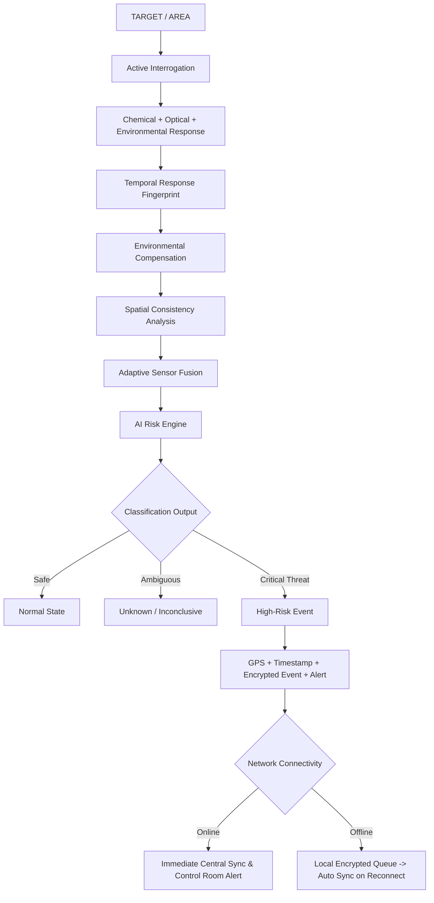

# NARCOSCAN
## Context-Aware Multimodal Narcotics Screening & Railway Threat Intelligence System
*Smart India Hackathon (SIH 2026) — Railway Protection Force (RPF) Threat Intelligence*

---

## 1. Executive Positioning

### Core Idea
Do not compete with mature commercial Raman/IMS instruments by claiming to be a better chemical identifier. Instead, build a railway-specific screening ecosystem that combines **active interrogation, multimodal response analysis, environmental compensation, spatial correlation, AI risk scoring, offline operation, and centralized RPF monitoring.**

> ### One-Line Differentiation
> **Existing systems primarily identify a substance at the point of measurement; NARCOSCAN creates a context-aware chemical screening network that identifies suspicious anomalies across crowded railway environments and automatically escalates them to centralized monitoring.**

---

## 2. Proposed Detection Architecture

The complete detection pipeline operates in a continuous, context-aware sequence from physical interrogation to centralized intelligence:



---

## 3. Why the Approach Is Different

| Dimension | Existing Handheld Approach | NARCOSCAN Proposal |
| :--- | :--- | :--- |
| **Primary Objective** | Point / sample chemical identification | Rapid, non-intrusive railway screening & escalation |
| **Sensing** | Usually one dominant modality | Multimodal sensor fusion |
| **Measurement** | Point measurement | Temporal response fingerprint + spatial correlation |
| **Environment** | Device-specific mitigation | Dynamic local environmental baseline & compensation |
| **AI** | Library matching / classification | Adaptive confidence + contextual anomaly detection |
| **Unknowns** | Often library-dependent | Explicit *Unknown / Inconclusive* class |
| **Network** | Primarily standalone / air-gapped | Distributed detection mesh network |
| **Location** | Not necessarily central | Automatic GPS & station zone tagging |
| **Offline** | Varies / device-local only | Offline-first encrypted event queue with auto-sync |
| **Operations** | Instrument-centric (operator interprets raw data) | RPF workflow + centralized control room integration |
| **Analytics** | Individual measurement result | Cross-device spatial/temporal anomaly correlation |

---

## 4. The Four Main Innovation Layers

### A. Active Multimodal Interrogation
Instead of relying only on passive concentration readings, the proposed architecture observes controlled, time-varying responses across multiple sensing modalities (chemical, optical, thermal, and ambient) and converts them into a comprehensive **response fingerprint**.

### B. Context-Aware Environmental Compensation
The system continuously models temperature, humidity, background chemical signals, and sensor drift. The classifier works with **contextual deviation** rather than blindly interpreting raw sensor values against static thresholds.

### C. Spatial Chemical Response Mapping
Multiple measurements are dynamically associated with location and scan position to identify **spatially consistent anomalies** across platforms, checkpoints, and coaches rather than treating every reading as an isolated point.

### D. Network-Level Threat Intelligence
Individual handheld units become active nodes in a distributed sensing network. The central system correlates time, location, confidence, and environmental context to identify repeated or clustered anomalies across the entire railway division.

---

## 5. Operational Workflow

```
┌───────┐
│ Step 1│  Operator starts screening ─── Minimal interaction required
└───────┘
    │
┌───────┐
│ Step 2│  Device establishes / updates environmental baseline ─── Compensates for station conditions
└───────┘
    │
┌───────┐
│ Step 3│  Active scan acquires multimodal response ─── Chemical + optical + environmental data
└───────┘
    │
┌───────┐
│ Step 4│  Edge AI extracts response features ─── Works locally on device, including offline
└───────┘
    │
┌───────┐
│ Step 5│  Fusion engine calculates confidence ─── Evaluates: Normal / Unknown / High-Risk
└───────┘
    │
┌───────┐
│ Step 6│  High-risk event is generated ─── Tagged with GPS + Timestamp + Device ID
└───────┘
    │
┌───────┐
│ Step 7│  Event is encrypted and transmitted ─── Immediate online alert to RPF
└───────┘
    │
┌───────┐
│ Step 8│  If offline, event is queued locally ─── Automatic synchronization once reconnected
└───────┘
    │
┌───────┐
│ Step 9│  Control room receives and correlates events ─── Live station map + alert + analytics
└───────┘
```

---

## 6. What We Should NOT Claim

> ### Important Boundary & Defensibility Principles
> - **Do NOT claim** that a low-cost prototype can identify every narcotic with forensic laboratory accuracy.
> - **Do NOT claim** that a positive screening result definitively proves possession in a legal/judicial sense.
> - **Do NOT claim** that one inexpensive sensor can replace established Raman, IMS, or FTIR laboratory systems.
>
> **The Defensible Claim:**  
> Intelligent, non-intrusive operational screening, dynamic environmental anomaly detection, and automated RPF escalation.

---

## 7. SIH MVP Demonstration

### System Components

- **Hardware**: Embedded controller / SBC, multimodal sensing modules, GPS module, display, battery power system, and wireless connectivity.
- **Edge Software**: Signal acquisition, feature extraction, real-time environmental compensation, ML inference, and risk scoring engine.
- **Offline Resilience**: Encrypted local event database and automatic synchronization queue.
- **Backend**: Secure ingestion API, event processing pipeline, alert dispatch engine, and central database.
- **RPF Dashboard**: Live device status, interactive railway station/track map, real-time alerts, event history, and trend analytics.

### Live Demonstration Sequence

$$\text{Scan} \longrightarrow \text{Classify} \longrightarrow \text{Risk Score} \longrightarrow \text{GPS Tag} \longrightarrow \text{Encrypted Event} \longrightarrow \text{Control-Room Alert} \longrightarrow \text{Network-Offline Scan} \longrightarrow \text{Automatic Sync}$$

---

## 8. Final Positioning for Judges

> ### Summary Statement for Evaluation Panel
> *"We are not trying to reinvent Raman or IMS. We are reinventing the operational screening layer around chemical detection for crowded railway environments—using multimodal response fingerprints, environmental context, spatial correlation, edge AI, and a secure offline-capable RPF threat-intelligence network."*
